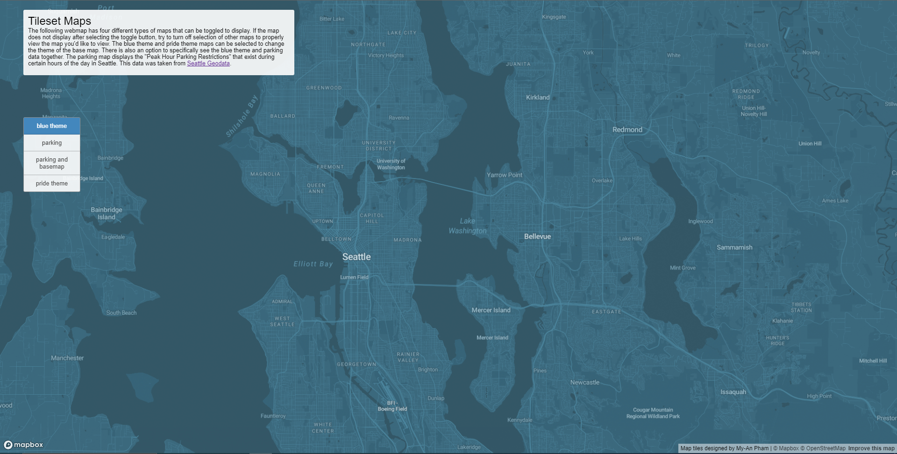
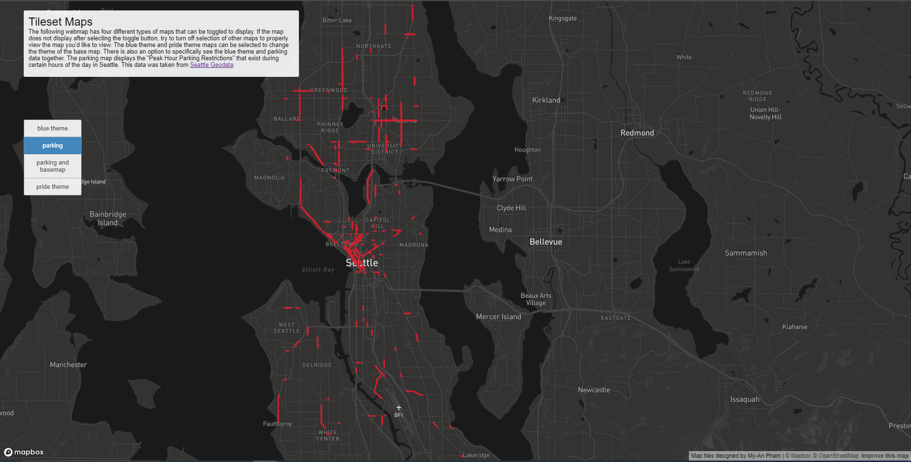
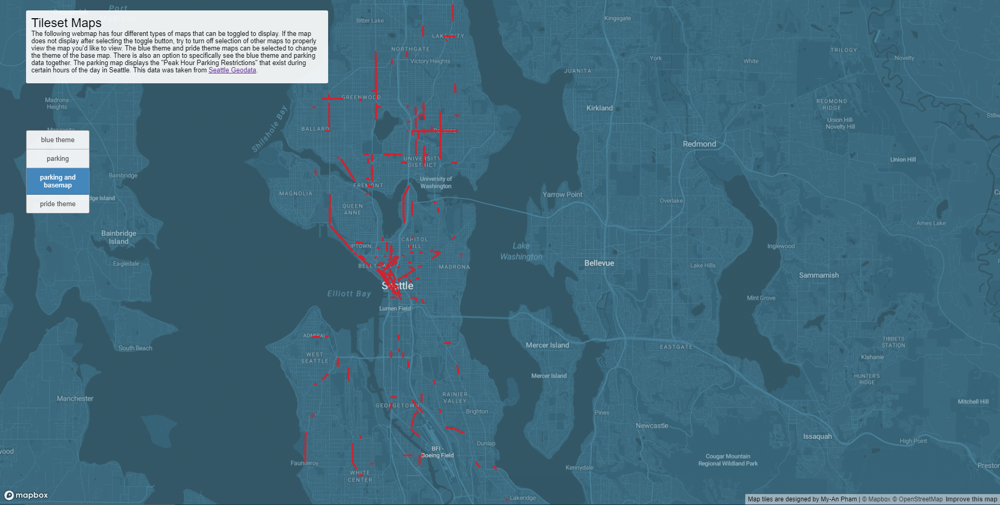
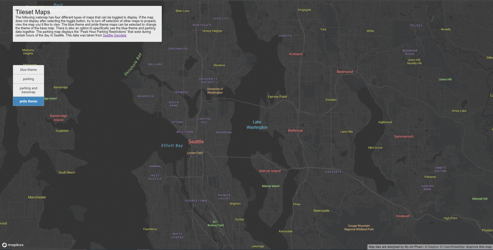

# [Tilesets Map](https://phammy22.github.io/tilesets_geog458_lab04/index.html)

The following are the four tileset maps that I have created for my web map, all showcasing the city of Seattle in Washington. The zoom levels of each tile set are between 10-13. This is was done to ensure that the tilesets could be small enough to properly uploaded to github to be used on the map.

### Tileset 1: Blue Theme

This tileset is a monochrome basemap using blue colors.

### Tileset 2: Parking Data

This tileset shows data from [Seattle GeoData](https://data-seattlecitygis.opendata.arcgis.com/datasets/SeattleCityGIS::peak-hour-parking-restrictions-3/about) outlining areas where there are certain parking restrictions during peak hours in Seattle.

### Tileset 3: Parking Data and Blue Theme

This tileset is a combination of the parking data on top of the blue themed basemap.

### Tileset4: Pride Theme

This tileset is a monochrome basemap using dark grey colors, with the labels of the water, land, streets, etc. being colors of the rainbow to represent LGBTQA+ pride.
